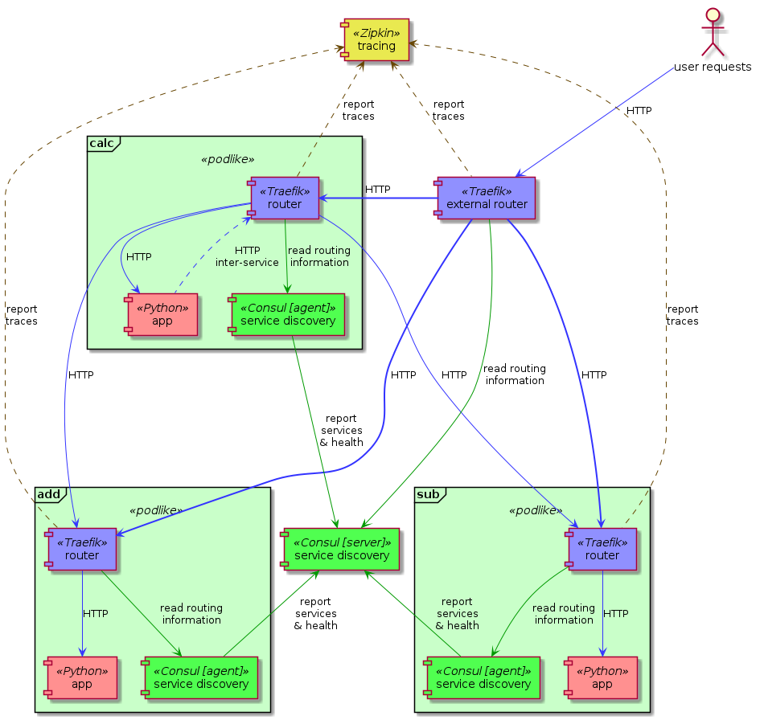

# Service mesh example

This stack demonstrates 3 simple Python HTTP server applications, and particularly, the HTTP routing between them. The point to demonstrate here, is that the services themselves don't need to worry about dealing with service discovery or any other means of finding the target applications to send requests to, and can conveniently just talk to their tightly coupled reverse proxies. The applications need to implement the business logic only.

The actual applications are quite simple:
- `calc` is a *monolithic* calculator application we want to break up now
- `add` is only responsible for the `+` operation
- `mul` is only responsible for the `*` operation
- `calc` accepts `add` and `mul` requests too, but it will just forward them to its local proxy
- `calc` still supports the `sub` and `div` operations itself

Each of the applications is coupled with a [Consul](https://www.consul.io/) agent that joins to a central server in the stack, and a [Traefik](https://traefik.io/) instance that accepts incoming requests from the main routing proxy which handles external requests from users. The *Traefik* instances connect to the apps on `localhost`, within the *"pod"*, and so do they to the coupled *Consul* agent to read the list of available, healthy services and their configuration.



There's an [OpenTracing](http://opentracing.io/) compatible [Zipkin](https://zipkin.io/) server in the stack as well, which collects the traces from each *Traefik* instance. Again, the applications don't even have to be aware of tracing, their coupled proxy takes care of it for them.

> The `stack-inline.yml` is the same apps and configuration as the `stack.yml` is, but everything you'd normally put in a config file is inlined, so it can be started without having to clone the repository.

## Usage

To deploy the stack straight from this repository:

```shell
$ curl -fsSL https://raw.githubusercontent.com/rycus86/podlike/master/examples/service-mesh/stack-inline.yml | docker stack deploy -c - mesh
```

Then try some example requests:

```shell
$ curl -s http://127.0.0.1/v1/add/12/47
59
$ curl -s http://127.0.0.1/v2/add/12/47
59
$ curl -s http://127.0.0.1/v1/mul/12/3
36
$ curl -s http://127.0.0.1/v2/mul/12/3
36
$ curl -s http://127.0.0.1/v1/sub/12/30
-18
$ curl -s http://127.0.0.1/v1/div/128/17
7.52941176471
```

Or launch it on the [Docker Playground](https://labs.play-with-docker.com/?stack=https://raw.githubusercontent.com/rycus86/podlike/master/examples/service-mesh/stack-inline.yml&stack_name=mesh) and check the services on the exposed host.

*Traefik* listens on port `80` for incoming requests as shown above, plus its dashboard is accessible on port `8080`, so you can have a look at the generated frontends and backends, and also some health stats. The *Consul* management UI is available on port `8500`, where you can see the services, their health and metadata. Finally, *Zipkin* listens on port `9411`, where you can see how the requests are routed and processed.
